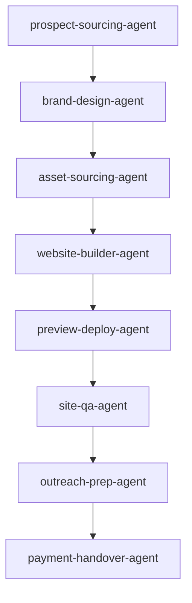

# Framewrk — Business Blueprint

> **Status:** draft · **Stage:** idea · **Business type:** other · **Last updated:** 2026-07-11

## TL;DR
- The founder manually finds a no-website business on Google Maps and **pastes its Google Business Profile/Maps link** into the Framewrk dashboard — no automated scraping/search.
- One click generates a fully AI-branded, agency-quality site for them — before they pay anything.
- The founder calls/messages the owner with a **live preview link**; if they say yes, they pay a **one-time fee** ($497 website / $997 website+dashboard) via Stripe.
- On payment, the client gets full source code and simple instructions to point their own domain at it — no lock-in, no retainer.
- An optional **booking/ordering dashboard** add-on turns the site into a real sales channel for appointment- or product-based businesses.
- Built entirely on **Cloudflare** (Workers + Queues + D1 + Pages) — deliberately **no n8n**; the pipeline is code triggered by background jobs, not visual workflow nodes.

---

## Business

**Framewrk** — *"The website is already built. All you have to do is say yes."*

Framewrk finds local businesses that show up on Google Maps with no website, uses AI to one-click generate a fully branded, agency-quality website (and optionally a booking/ordering dashboard), and shows the owner a live working preview before they ever pay a cent. Once they say yes, they pay a one-time fee and get full ownership of the code to point their own domain at.

**Stage:** idea · **Location:** Remote / Nationwide (US)

---

## Market & ICP

**Target segment:** Local service & retail businesses with no website — restaurants, contractors, salons, med spas, boutiques, studios, and similar operators discoverable on Google Maps.

**ICP:** Owner/operator of a small local business (1–20 employees) that appears on Google Maps but has no website, and has been putting off getting one due to cost, time, or know-how.

**Trigger events:**
- Business is discoverable on Google Maps but has no website, losing searchers to competitors who do
- Owner has been meaning to get a website but hasn't had the time, budget, or technical know-how

**Disqualifiers:** already has a modern active website; franchise/corporate location with no local purchasing authority.

**Pain points:**
- No online presence despite being findable on Google Maps
- No time, budget, or skill to build a professional site themselves
- DIY builders or local freelancers are low-quality, slow, or too expensive
- No easy way for customers to book or order online

**Competitors:**
| Competitor | Framewrk's edge |
|---|---|
| DIY builders (Wix, Squarespace, GoDaddy) | Finished, professionally branded site with zero owner effort — built and live before they pay |
| Freelance designers / local agencies | Live working preview before any payment; far faster and cheaper |

---

## Services & Pricing

| Tier | Price | Includes |
|---|---|---|
| **Website** (`tier_website`) | $497 | AI-designed brand-matched site, sourced/AI imagery, mobile-responsive, live preview before payment, full code + domain instructions on handover |
| **Website + Dashboard** (`tier_dashboard`) | $997 | Everything above + booking/ordering portal + basic owner admin view |

One-time fee only, no retainer. Clients who want ongoing maintenance or further automation are referred to **Phoenix Automation**.

---

## Value Proposition

> **"We build your business a stunning, on-brand website before you ever pay a cent — you only pay if you love it."**

- Site is fully built and live on a preview link before any payment — removes all client risk
- AI-driven, brand-matched design aimed at premium/agency polish, not a generic template
- One-time fee, no lock-in — client owns the code, adds their own domain
- Optional dashboard/portal add-on for booking or ordering
- Founder-led personal outreach (not blind spam) keeps close rates high

---

## Delivery Pipeline

| Agent | Role | Status |
|---|---|---|
| prospect-sourcing-agent | Parses a founder-submitted Google Business Profile/Maps link into a prospect record (no auto-search) | planned |
| brand-design-agent | Produces a design brief (palette, type, tone, layout) per niche | planned |
| asset-sourcing-agent | Pulls Instagram/GBP images or generates AI placeholder imagery | planned |
| website-builder-agent | Generates the full site (and dashboard) codebase | planned |
| preview-deploy-agent | Deploys to a shareable Cloudflare Pages preview link | planned |
| site-qa-agent | Automated QA checklist before outreach | planned |
| outreach-prep-agent | Builds the call script + contact package for the founder | planned |
| payment-handover-agent | Stripe payment link → code + domain handover on payment | planned |

*Planned but not yet scoped:* a **Pipeline Reporting Agent** for weekly built/contacted/sold/revenue summaries.

**Operations flow:** founder pastes a Google Business Profile/Maps link into the dashboard → one-click build → automated QA → founder-led outreach with preview link → Stripe payment → automated handover (code + domain guide), with a Phoenix Automation referral offered for ongoing needs.

---

## Tech Stack

- **LLM:** OpenRouter, free-tier model by default — no separate Anthropic/OpenAI API billing (a Claude.ai/Claude Code or ChatGPT subscription does not grant free programmatic API access); upgrade to a paid OpenRouter model per-stage only if free-tier quality falls short (site-generation is the likely first candidate)
- **Platform (no n8n):** Cloudflare Workers (API) + Cloudflare Queues (background job pipeline) + Cloudflare D1 (database) + Cloudflare Pages (dashboard frontend + site preview hosting) — the delivery pipeline is written as code triggered by queue jobs, not visual workflow nodes
- **Integrations:** Google Business Profile/Maps page (manually submitted), Instagram Graph API, AI image generation API, Stripe, domain registrar guidance
- **Internal platform:** Framewrk's own one-click dashboard, React/Vite/Tailwind frontend on the Cloudflare backend above (not yet built — see gaps)

---

## Team

Solo founder today, handling review/approval, outreach calls, closing, and handover. Next hire trigger: an outreach/sales contractor once sourced+built volume exceeds what the founder can personally call through each week.

---

## KPIs

| Category | Metric | Target |
|---|---|---|
| Operational | Websites generated/week | 20+ |
| Operational | Time from sourced → preview ready | <15 min |
| Operational | QA pass rate on first generation | >90% |
| Financial | Sites sold/week | 5+ |
| Financial | Revenue/week | $2,500+ |
| Financial | Avg deal size | $650 |
| Client success | Preview-to-close conversion | >25% |
| Client success | Clean handovers | 100% |

---

## Assumptions to Validate

1. Cold local business owners will trust and pay for a website shown to them without prior relationship.
2. Instagram/GBP images can be reused in previews and final sites without explicit permission.
3. AI-generated sites can hit genuinely premium design quality without human designer touch-up.
4. A one-time-fee-only model (no retainer) is enough to sustain and grow the business.

## Known Gaps

> ⚠️ Needs input: **AI image generation provider** not yet selected (Cloudflare Workers AI vs. Replicate/Flux etc). (severity: medium)

> ⚠️ Needs input: **Internal platform is not yet built** — stack is decided (Cloudflare Workers + Queues + D1 + Pages, no n8n) but no code exists yet. (severity: high)

> ⚠️ Needs input: **Domain handover process** — self-serve guide vs. done-for-them not finalized. (severity: low)

> ⚠️ Needs input: **No sale agreement/ToS drafted yet** for the one-time website sale (ownership transfer, image rights, refund policy). (severity: medium)

---

## Next Actions (from build priority)

1. **prospect-sourcing-agent** — nothing else runs without a pipeline of no-website Google Maps businesses (critical)
2. **brand-design-agent** — defines the design brief that makes sites feel premium, not templated (critical)
3. **asset-sourcing-agent** — real or AI imagery instead of placeholders (high)
4. **website-builder-agent** — the core one-click AI site generator; this is the product (critical, effort: XL)
5. **preview-deploy-agent** — turns a build into the shareable preview link that is the entire pitch (critical)

Full 10-item build order, including the internal platform build and the legal/ToS review, is in `business-blueprint.json` → `build_priority`.
