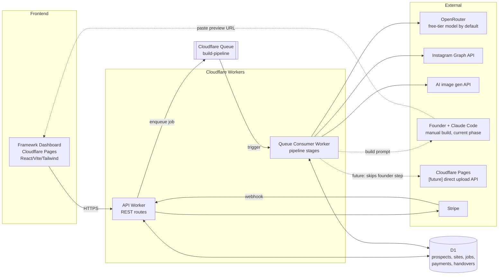

# Framewrk — Build Spec

> **Status:** in build — hybrid manual-build phase live
> **Source blueprint:** `docs/blueprints/framewrk/business-blueprint.json`
> **Last updated:** 2026-07-12

---

## 1. What this document is

A concrete engineering spec for the Framewrk internal platform: the one-click
dashboard + background pipeline that turns a Google Business Profile link
into a live, brand-matched website preview, and carries it through outreach,
payment, and handover.

This is **not** the blueprint (business model, pricing, market) — see
`business-blueprint.md` for that. This is how the platform gets built.

No n8n. Everything below runs on Cloudflare (Workers + Queues + D1 + Pages).

### 1.1 Two build modes — where we are now

The pipeline runs in one of two modes, both described in this doc:

- **Hybrid manual-build (current, live now).** OpenRouter's free tier
  composes a build *prompt* instead of the site itself. The founder pastes
  that prompt into their own Claude Code session, builds/tweaks the site,
  pushes it to their own GitHub, connects it to Cloudflare Pages, and pastes
  the resulting live URL back into the dashboard. Automated technical QA
  then resumes the pipeline through to outreach-ready. This avoids paying
  for a code-generation-capable API before the business has revenue.
- **Fully automated (planned, not yet built).** Once the first 2–3 paying
  clients justify the cost of a code-generation-capable API, the
  `generating` stage will call that API directly to produce the site files,
  and a `deploying` stage will push them straight to Cloudflare Pages via
  the direct-upload API — no manual paste-and-build step. The stage
  breakdown, data model fields, and API route for this mode are kept in
  this spec (marked **[future]**) so the switch is additive, not a rewrite.

---

## 2. Architecture



**Why this shape:**
- One Cloudflare account, one bill, nothing to keep alive — Workers are
  request/event-driven, not a server you manage.
- Queues give us the "background automation running" feel without n8n:
  the API Worker enqueues a job and returns immediately; the Consumer
  Worker does the (possibly slow) AI/deploy work and writes results to D1.
  The dashboard polls or uses a lightweight `GET /jobs/:id` status check.
- D1 (SQLite at the edge) is enough for solo-founder scale; no separate
  Postgres to provision.
- The dashed lines are the current hybrid manual-build hand-off: the
  Consumer Worker's job ends at "here's your build prompt," and the
  pipeline pauses (`awaiting_manual_build`) until the founder submits a
  live preview URL back through the dashboard. The **[future]** solid path
  to Cloudflare Pages replaces that hand-off once the automated `generating`
  + `deploying` stages are built.

---

## 3. Data model (D1)

```sql
-- One row per business the founder has submitted
CREATE TABLE prospects (
  id TEXT PRIMARY KEY,               -- uuid
  google_maps_url TEXT NOT NULL,
  business_name TEXT,
  category TEXT,
  address TEXT,
  phone TEXT,
  google_photos_json TEXT,           -- raw photo URLs pulled from the page
  instagram_url TEXT,
  notes TEXT,                        -- founder's manual notes
  status TEXT NOT NULL DEFAULT 'submitted',
  -- status: submitted -> building -> qa_pass/qa_fail -> outreach_ready
  --         -> sent -> interested -> paid -> handed_off -> closed_lost
  created_at TEXT NOT NULL,
  updated_at TEXT NOT NULL
);

-- One row per pipeline run (a prospect can be rebuilt/regenerated)
CREATE TABLE builds (
  id TEXT PRIMARY KEY,
  prospect_id TEXT NOT NULL REFERENCES prospects(id),
  service_tier TEXT NOT NULL,        -- 'website' | 'website_dashboard'
  design_brief_json TEXT,
  asset_manifest_json TEXT,          -- which images sourced vs AI-generated
  site_files_r2_prefix TEXT,         -- [future] once automated generating/deploying land
  build_prompt TEXT,                 -- the generated, paste-into-Claude-Code build prompt
  preview_url TEXT,                  -- live URL (founder-submitted in hybrid mode, or Pages upload URL in future automated mode)
  qa_verdict TEXT,                   -- 'pass' | 'fail' | null
  qa_report_json TEXT,
  call_script TEXT,                  -- generated outreach talking points
  status TEXT NOT NULL DEFAULT 'queued',
  -- current hybrid-mode status flow: queued -> designing -> sourcing_assets
  --   -> generating -> awaiting_manual_build -> qa_running -> ready -> failed
  --   (qa_running can revert to awaiting_manual_build on qa_verdict = 'fail')
  -- [future] fully-automated flow replaces awaiting_manual_build with a
  --   'deploying' status: ... -> generating -> deploying -> qa_running -> ready
  error TEXT,
  created_at TEXT NOT NULL,
  updated_at TEXT NOT NULL
);

-- Background job tracking (what the dashboard polls)
CREATE TABLE jobs (
  id TEXT PRIMARY KEY,
  build_id TEXT NOT NULL REFERENCES builds(id),
  stage TEXT NOT NULL,               -- matches builds.status values above
  state TEXT NOT NULL DEFAULT 'pending', -- pending | running | done | error
  detail TEXT,
  created_at TEXT NOT NULL,
  updated_at TEXT NOT NULL
);

-- Payment + handover tracking
CREATE TABLE payments (
  id TEXT PRIMARY KEY,
  prospect_id TEXT NOT NULL REFERENCES prospects(id),
  build_id TEXT NOT NULL REFERENCES builds(id),
  stripe_payment_link TEXT,
  stripe_payment_link_id TEXT,
  stripe_checkout_session_id TEXT,
  amount_cents INTEGER,
  status TEXT NOT NULL DEFAULT 'pending', -- pending | paid | refunded
  handover_sent_at TEXT,
  handover_package_r2_key TEXT,       -- zipped code + domain guide
  created_at TEXT NOT NULL,
  updated_at TEXT NOT NULL
);
```

Generated site files themselves are stored in **R2** (Cloudflare's object
storage), not D1 — D1 just holds the prefix/pointer. This keeps site
codebases (potentially hundreds of files across many prospects) out of the
SQL database.

---

## 4. API Worker — routes

| Method | Route | Purpose |
|---|---|---|
| `POST` | `/prospects` | Submit a Google Maps/Business Profile link (+ optional notes) → creates a prospect, kicks off `prospect-sourcing` (synchronous — just parses the page, no AI needed) |
| `GET` | `/prospects` | List all prospects with current status, for the dashboard's main table |
| `GET` | `/prospects/:id` | Full detail for one prospect, including its builds |
| `POST` | `/prospects/:id/build` | Kick off a build — enqueues the pipeline job (`service_tier`: website or website_dashboard) |
| `GET` | `/builds/:id` | Build detail: current stage, build prompt, preview URL when ready, QA report, call script |
| `GET` | `/builds/:id/jobs` | Job history for a build (for a live-updating progress view) |
| `POST` | `/builds/:id/submit-preview` | **Hybrid mode.** Founder submits the live preview URL after manually building + deploying from the generated prompt; requires build status `awaiting_manual_build`, sets `preview_url`, moves status to `qa_running`, and enqueues the `qa-running` stage. **[future]** unnecessary once automated `deploying` exists. |
| `POST` | `/prospects/:id/send-payment-link` | Generates a Stripe Payment Link for the approved build, marks prospect `sent` |
| `POST` | `/webhooks/stripe` | Stripe webhook — on `checkout.session.completed` / payment link paid, marks `payments.status = paid`, enqueues `handover` job |
| `GET` | `/payments/:id/handover` | Fetch the handover package (zip download link + domain instructions) once generated |
| `POST` | `/prospects/:id/mark-lost` | Manual close-out when a prospect declines |

Auth: this is a founder-only internal tool. Simplest viable option is a
single shared bearer token (Cloudflare Worker secret) checked on every
route, enforced at the Pages/Workers edge — no user accounts needed for v1.

---

## 5. Queue Consumer — pipeline stages

Each stage below is a Worker function triggered by the queue message,
mapping 1:1 to the agents already defined in the blueprint's `agent_map`.
On completion, it writes results to `builds`/`jobs` and enqueues the next
stage (or marks `failed` with the error captured for the dashboard).

### 5.1 Current (hybrid manual-build) stages

1. **brand-design** (`brand-design-agent`) — OpenRouter call: takes
   `business_name`, `category`, any Instagram bio/notes → returns a design
   brief (palette, typography, tone, layout direction) as JSON.
2. **sourcing-assets** (`asset-sourcing-agent`) — pulls photos from
   `google_photos_json` and Instagram; for any that fail a basic quality
   check (resolution/aspect ratio) or are entirely absent, calls the AI
   image-gen API using the design brief as the style prompt.
3. **generating** (`website-builder-agent`) — OpenRouter call: instead of
   generating the site itself, composes a single detailed, ready-to-paste
   build prompt (business info + design brief + copywriting/asset
   guidance + an instruction to use AI-generated placeholder imagery if no
   real photos were sourced) targeting Claude Code as the executor. Stores
   it in `builds.build_prompt`, sets `build.status = 'awaiting_manual_build'`,
   and **stops** — no further stage is auto-enqueued. This is the pipeline's
   pause point: the founder now pastes the prompt into their own Claude Code
   session, builds/tweaks the site, pushes to their own GitHub, and connects
   it to Cloudflare Pages themselves.
4. **(founder hand-off, not a queue stage)** — the founder calls
   `POST /builds/:id/submit-preview` with the resulting live URL once it's
   deployed. This sets `preview_url`, moves status to `qa_running`, and
   enqueues `qa-running`.
5. **qa-running** (`site-qa-agent`) — plain technical `fetch()`-based checks
   against the submitted preview URL (no LLM call): page responds 2xx,
   `<html>` present, viewport meta tag present, `<title>` present. Sets
   `qa_verdict` + `qa_report_json`. On pass, enqueues `outreach-prep`. On
   fail, reverts `build.status` back to `awaiting_manual_build` (with
   `qa_verdict = 'fail'`) and sets `prospects.status = 'qa_fail'` so the
   founder can fix the live site and resubmit the same or an updated URL.
6. **outreach-prep** (`outreach-prep-agent`) — OpenRouter call: generates a
   short call script/talking points referencing something specific to the
   business, only runs after QA pass. Sets `build.status = 'ready'` and
   `prospects.status = 'outreach_ready'`.
7. **handover** (`payment-handover-agent`) — triggered by the Stripe
   webhook, not part of the build pipeline above. Zips the final site
   files + a one-page domain-connection guide (Cloudflare/Namecheap/GoDaddy
   instructions), uploads to R2, marks `payments.handover_sent_at`.

Failure handling: any stage error marks the `build` `failed` with the
error message surfaced in the dashboard; the founder can retry a single
failed stage rather than rerunning the whole pipeline.

### 5.2 [future] Fully-automated stages

Once a code-generation-capable API is worth paying for (target: after the
first 2–3 paying clients), stages 3–4 above are replaced with:

3. **generating** (`website-builder-agent`) — API call to a
   code-generation-capable model: generates the full static site (see §6
   below) from the design brief + assets + service tier, writes files to R2.
   This is the stage most likely to need a paid, higher-quality model even
   after the rest stay on OpenRouter's free tier.
4. **deploying** (`preview-deploy-agent`) — pushes the R2 file set to
   Cloudflare Pages via the direct-upload API, creating a project per
   prospect (e.g. `framewrk-preview-<prospect-slug>`), stores the resulting
   URL directly — no founder hand-off, no `submit-preview` call needed.

Everything downstream (`qa-running`, `outreach-prep`, `handover`) stays the
same in both modes; only how `preview_url` gets populated changes. This
means switching modes later is additive (new `generating`/`deploying`
handlers + a feature flag on which one to enqueue) rather than a rewrite.

---

## 6. Generated site format (decision)

**Default: plain static HTML/CSS/vanilla JS**, one directory per site, no
build step, no framework, no dependencies.

Rationale: deploys to Cloudflare Pages with zero config, and at handover
the client gets a folder of files that will run on *literally any* host —
not just Cloudflare — which matches "client owns the code, adds their own
domain" cleanly. A framework (e.g. Astro/Next) would look more
"engineered" but adds a build step the client would need to reproduce or
you'd need to ship pre-built output only, which is more fragile for a
non-technical handover.

The `website_dashboard` tier's booking/ordering portal is the one place
this gets more involved — flagged as an open question in §8.

---

## 7. Dashboard (Cloudflare Pages, React/Vite/Tailwind)

Mirrors the visual style of the existing `dashboard/` app in this repo.

| Page | Purpose |
|---|---|
| **Pipeline** (home) | Table of all prospects with status badges; "+ New Prospect" form (paste Google Maps link, optional notes) |
| **Prospect detail** | Parsed business info, "Build Website" / "Build Website + Dashboard" buttons, live-updating pipeline progress (stage-by-stage), preview link + call script once ready |
| **Outreach** | Filtered view of `ready`/`sent` prospects — one-click "Send Payment Link" |
| **Handovers** | Paid prospects awaiting/completed handover, download link for the handover package |
| **Settings** | Stripe key, image-gen API key, Instagram token — stored as Worker secrets, this page just shows connection status |

---

## 8. Open questions before/while building

These are called out as gaps in the blueprint; flagging here so they don't
get silently decided mid-build:

1. **AI image generation provider** — Cloudflare Workers AI (keeps
   everything in one account, cheaper) vs. a hosted model via Replicate
   (e.g. Flux, likely higher quality). Recommendation: start with
   Cloudflare Workers AI for cost/simplicity, swap later if quality isn't
   good enough.
2. **Booking/ordering portal (dashboard tier)** — needs its own data model
   (a per-client D1 database or a lightweight table set) and either a
   simple built-in payment/booking flow or a wrapper around an existing
   service (e.g. Calendly embed, Stripe Checkout for products). This tier
   is meaningfully more complex than the base website and is not fully
   scoped yet — recommend treating it as a fast-follow after the website-only
   pipeline is proven end to end.
3. **Instagram access** — the Instagram Graph API generally requires the
   *business* to connect their own account (OAuth), which most of these
   prospects won't have set up. For v1, more realistic to treat Instagram
   images as "founder manually saves a few photos and uploads them" rather
   than a live API pull. Recommend downgrading this from an automated
   integration to a manual upload option in the prospect form for now.
4. **Custom domain for the dashboard itself** — fine to run on the default
   `*.pages.dev` URL for a founder-only internal tool; not a blocker.
5. **Which OpenRouter `:free` model, exactly** — free-tier model availability
   on OpenRouter changes over time (models get added/retired), so pick the
   current best `:free` option when actually implementing each Claude-call
   stage rather than hardcoding one here. `website-builder-agent` (the
   site-generation stage) is the one most likely to need a paid upgrade if
   a free model's code output isn't good enough — try free first, upgrade
   that single call if needed.
6. **When to switch from hybrid to fully-automated (§5.2)** — target trigger
   is the first 2–3 paying clients, at which point the manual paste-into-
   Claude-Code step becomes the throughput bottleneck and justifies a
   code-generation-capable API bill. Not a hard rule — revisit if manual
   volume becomes painful sooner, or if revenue is slower than expected.

---

## 9. Build order

Matches `build_priority` in the blueprint, translated into engineering
tasks:

| # | Task | Depends on | Effort | Status |
|---|---|---|---|---|
| 1 | D1 schema + API Worker skeleton (`/prospects` CRUD, page-parsing for Google Maps links) | — | M | done |
| 2 | Dashboard shell + Pipeline page (submit form, prospect table) | 1 | S | done |
| 3 | Queue setup + `brand-design` stage | 1 | M | done |
| 4 | `sourcing-assets` stage (manual upload for v1, per open question 3) | 3 | S | done |
| 5 | `generating` stage — build-prompt composition via OpenRouter (hybrid mode, §5.1) | 3, 4 | M | done |
| 6 | `submit-preview` endpoint + `qa-running` stage against founder-submitted URL (hybrid mode) | 5 | M | done |
| 7 | `outreach-prep` stage + Prospect detail / Outreach dashboard pages (prompt display + submit-preview UI) | 6 | S | done |
| 8 | Stripe payment link + webhook + `handover` stage + Handovers page | 7 | M | not started |
| 9 | **[future]** Automated `generating` (code-gen API) + `deploying` (Cloudflare Pages direct upload) stages, retiring the founder hand-off (§5.2) | 8, revenue trigger in open question 6 | XL | not started |
| 10 | Booking/ordering portal (dashboard tier) | 9 | XL — fast-follow | not started |

Tasks 1–7 deliver the hybrid manual-build flow end to end and are live now.
Task 8 (payments/handover) is next. Task 9 (full automation) is intentionally
sequenced after revenue, per open question 6; task 10 stays last, per open
question 2.

---

## 10. Secrets/config needed

- `OPENROUTER_API_KEY` (OpenRouter — one key covers brand-design, build-prompt
  composition, and outreach-prep; defaults to a free-tier `:free` model, no
  Anthropic/OpenAI API billing required since neither a Claude.ai/Claude Code
  nor a ChatGPT subscription grants free programmatic API access — see gaps
  below)
- `CLOUDFLARE_API_TOKEN` (Workers AI if used for images now; **[future]**
  also needed for the automated Pages direct-upload `deploying` stage in
  §5.2 — not required for the current hybrid mode, since the founder
  connects Cloudflare Pages themselves)
- `STRIPE_SECRET_KEY`, `STRIPE_WEBHOOK_SECRET`
- `FRAMEWRK_DASHBOARD_TOKEN` (shared bearer token for dashboard auth)
- Image-gen provider key, once §8.1 is decided (Workers AI uses the same
  Cloudflare token; Replicate would need its own key)
